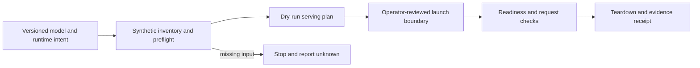

```mermaid
flowchart LR
    I["Versioned model and runtime intent"] --> P["Synthetic inventory and preflight"]
    P --> D["Dry-run serving plan"]
    D --> L["Operator-reviewed launch boundary"]
    L --> R["Readiness and request checks"]
    R --> T["Teardown and evidence receipt"]
    P -->|missing input| X["Stop and report unknown"]
```
