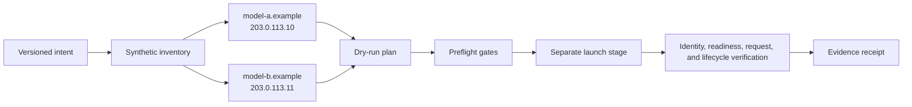

```mermaid
flowchart LR
  I["Versioned intent"] --> S["Synthetic inventory"]
  S --> A["model-a.example<br/>203.0.113.10"]
  S --> B["model-b.example<br/>203.0.113.11"]
  A --> D["Dry-run plan"]
  B --> D
  D --> G["Preflight gates"]
  G --> L["Separate launch stage"]
  L --> V["Identity, readiness, request, and lifecycle verification"]
  V --> E["Evidence receipt"]
```
